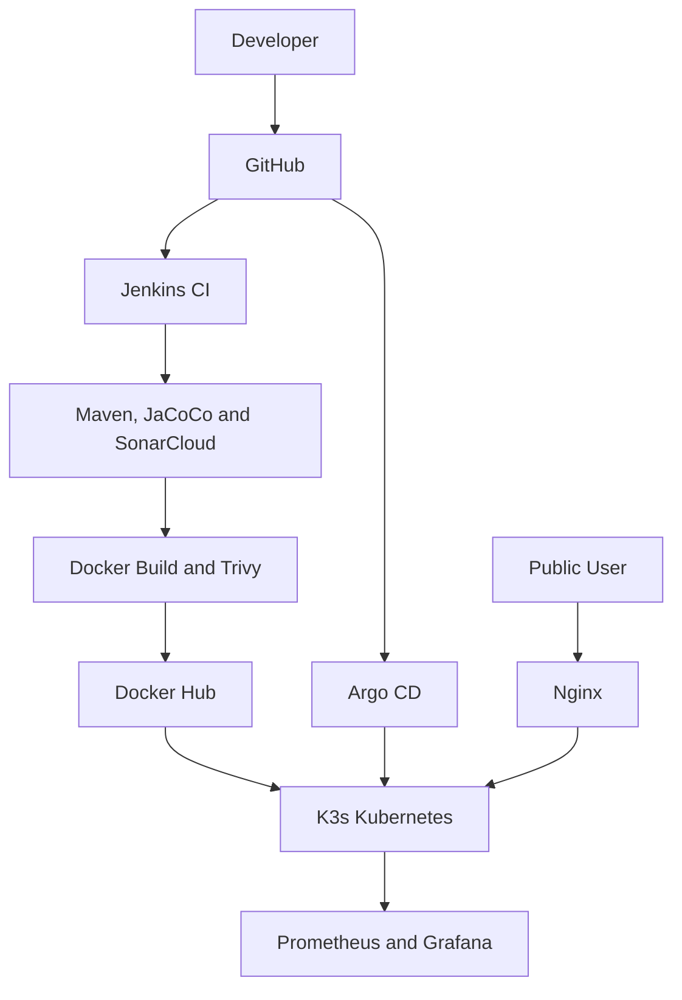

# AWS DevSecOps GitOps Pipeline

An end-to-end DevSecOps project that provisions AWS infrastructure, validates a Java application through quality and security gates, publishes immutable Docker images, deploys through Argo CD, and monitors Kubernetes using Prometheus and Grafana.

## Architecture



## Technology Stack

| Area | Tools |
|---|---|
| Cloud and IaC | AWS, Terraform |
| Application | Java 17, Maven |
| Testing | JUnit 5, JaCoCo |
| CI and quality | Jenkins, SonarCloud |
| Containers and security | Docker, Docker Hub, Trivy |
| Orchestration and GitOps | K3s, Kubernetes, Argo CD |
| Traffic | Nginx |
| Monitoring | Prometheus, Grafana, Alertmanager, Helm |
| Version control | Git, GitHub |

## Repository Structure

```text
app/          Java application, Maven configuration and Dockerfile
argocd/       Argo CD Application manifest
kubernetes/   Namespace, Deployment and Service
monitoring/   Helm values and Prometheus alert rule
nginx/        Reverse-proxy configuration
scripts/      EC2 bootstrap script
terraform/    AWS infrastructure code
Jenkinsfile   Continuous integration pipeline
```

## CI and GitOps Workflow

1. Code is pushed to GitHub.
2. Jenkins runs Maven tests and generates JaCoCo coverage.
3. SonarCloud enforces its quality gate.
4. Jenkins builds an immutable `build-*` Docker image.
5. Trivy scans for HIGH and CRITICAL vulnerabilities.
6. Jenkins pushes the approved image to Docker Hub.
7. The Kubernetes manifest is updated with the chosen image tag.
8. Argo CD synchronizes Git with the K3s cluster.
9. Prometheus collects metrics and Grafana displays them.

## Jenkins Pipeline

Pipeline stages:

- Verify tools
- Maven tests and JaCoCo coverage
- SonarCloud analysis
- JAR packaging
- Docker build
- Trivy scan
- Docker Hub push
- Artifact archiving

Required Jenkins credentials:

| Credential ID | Purpose |
|---|---|
| `sonar-token` | SonarCloud authentication |
| `dockerhub-credentials` | Docker Hub authentication |

Example immutable image: `girirajs7/devops-api:build-16`.

## Kubernetes and Argo CD

The application uses two replicas, health probes, resource limits and a NodePort Service.

Important commands:

- `kubectl apply -f kubernetes/`
- `kubectl rollout status deployment/devops-api -n devops`
- `kubectl get all -n devops`
- `kubectl apply -f argocd/application.yaml`
- `kubectl get application devops-api -n argocd`

Expected Argo CD status: `Synced / Healthy`.

## Monitoring and Alerting

The Helm `kube-prometheus-stack` provides Prometheus, Grafana, Alertmanager, kube-state-metrics and node-exporter.

Monitoring uses:

- Seven-day Prometheus retention
- 5 GiB Prometheus persistent storage
- 2 GiB Grafana persistent storage
- CPU and memory requests and limits
- Grafana Kubernetes dashboards
- Custom Prometheus alert rules

The `DevOpsApiReplicasUnavailable` alert fires when fewer than two API replicas remain available for more than 30 seconds.

## AWS Infrastructure

Terraform provisions the VPC, public subnet, Internet Gateway, route table, security group, EC2 instance and SSH key registration.

Important Terraform commands:

- `terraform init`
- `terraform fmt`
- `terraform validate`
- `terraform plan`
- `terraform apply`

SSH access is restricted to the administrator's current public `/32` IP address. Terraform variables, state files, private keys and credentials must not be committed.

## Application Endpoints

| Endpoint | Purpose |
|---|---|
| `/` | Deployment message |
| `/health` | Kubernetes readiness and liveness check |
| `/api/info` | Application version and environment |

Public traffic reaches Nginx on port 80. Nginx forwards requests to the Kubernetes NodePort Service on port 30080.

## Verified Reliability Tests

### Kubernetes self-healing

A running application pod was deleted manually. Kubernetes automatically created a replacement while the second replica continued serving traffic.

### Argo CD drift correction

The live Deployment was manually scaled from two replicas to one. Argo CD detected the drift and restored the replica count declared in Git.

### GitOps rollback and recovery

The immutable `build-16` release was rolled back to `1.0.0` using `git revert`. Reverting the rollback restored `build-16`, and Argo CD completed both rolling deployments.

### Monitoring alert

The application was temporarily reduced to one replica. Prometheus reported the custom alert as `firing` with `warning` severity. Argo CD then restored two healthy replicas.

## Security Practices

- Jenkins, Argo CD, Grafana and Prometheus use private SSH tunnels.
- SSH ingress is restricted to a single administrator IP.
- Tokens and passwords are stored in Jenkins Credentials.
- SonarCloud provides static analysis and a quality gate.
- Trivy blocks unacceptable image vulnerabilities.
- Kubernetes uses health probes and resource limits.
- Sensitive Terraform and credential files are excluded by `.gitignore`.

## Key Verification Commands

- `kubectl get nodes`
- `kubectl get pods -n devops`
- `kubectl get application devops-api -n argocd`
- `kubectl get pods -n monitoring`
- `kubectl rollout status deployment/devops-api -n devops`
- `curl http://127.0.0.1:30080/health`

## Project Outcomes

This project demonstrates:

- Reproducible AWS infrastructure using Terraform
- Automated testing, code quality and security gates
- Immutable Docker image versioning
- Declarative Kubernetes deployment
- Argo CD synchronization, self-healing and rollback
- Kubernetes rolling updates and pod self-healing
- Prometheus metrics, Grafana dashboards and alerting
